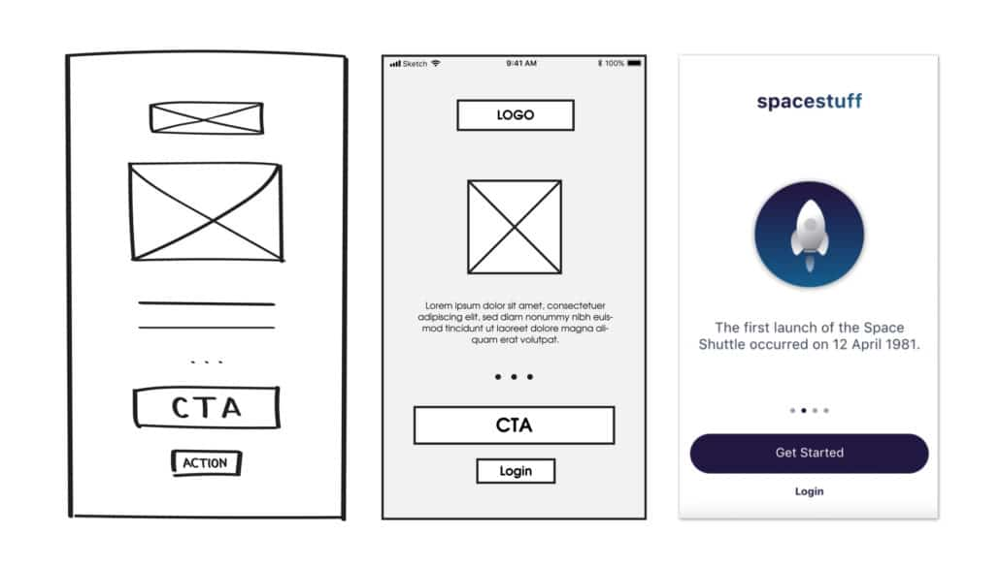
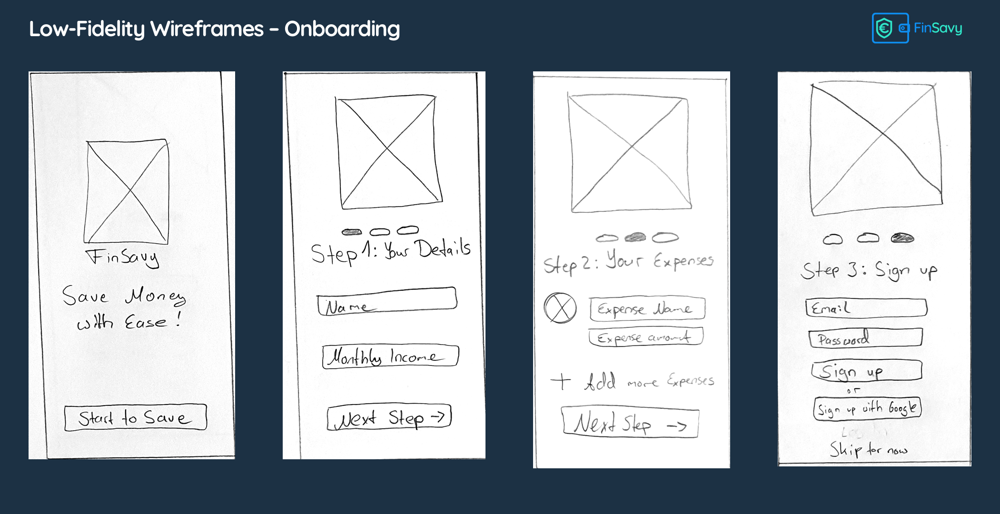
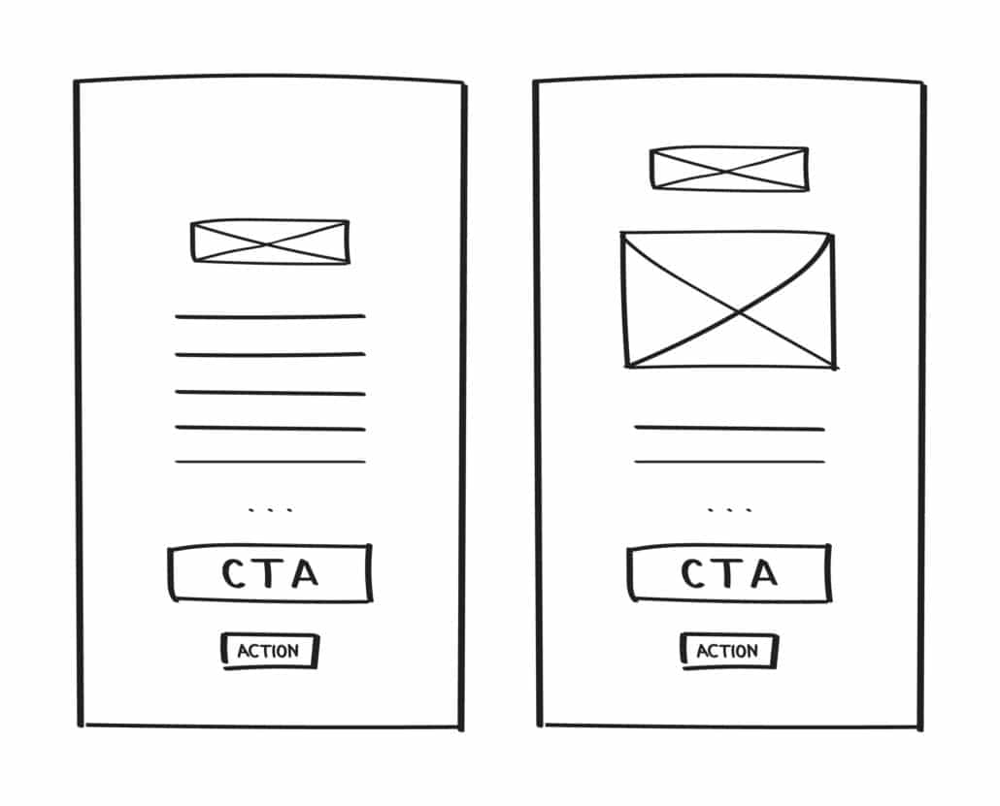
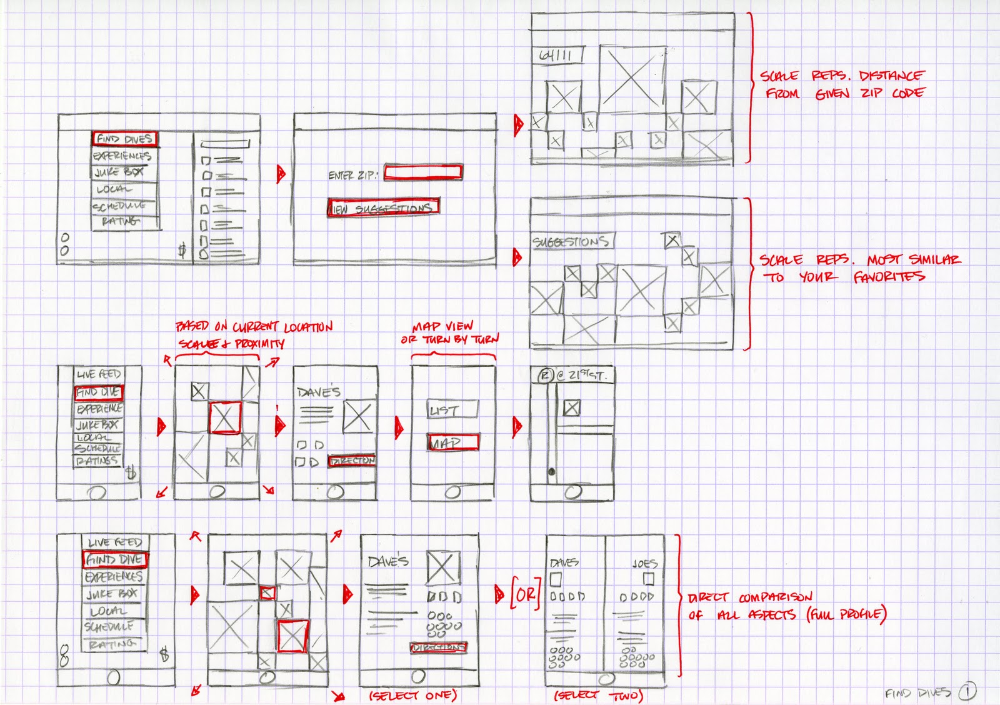
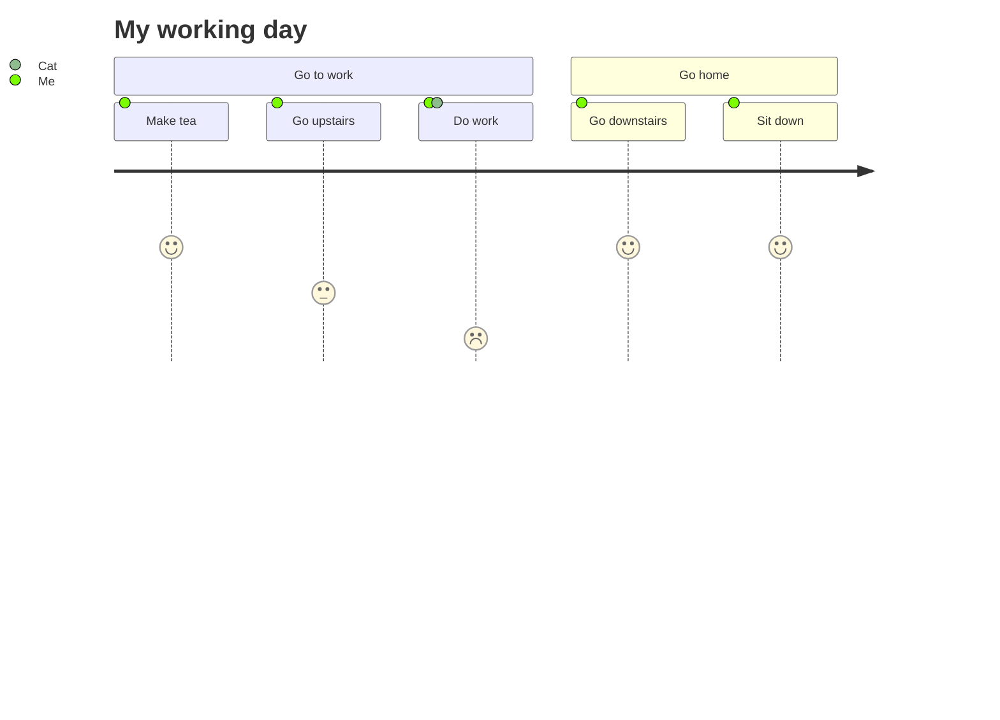
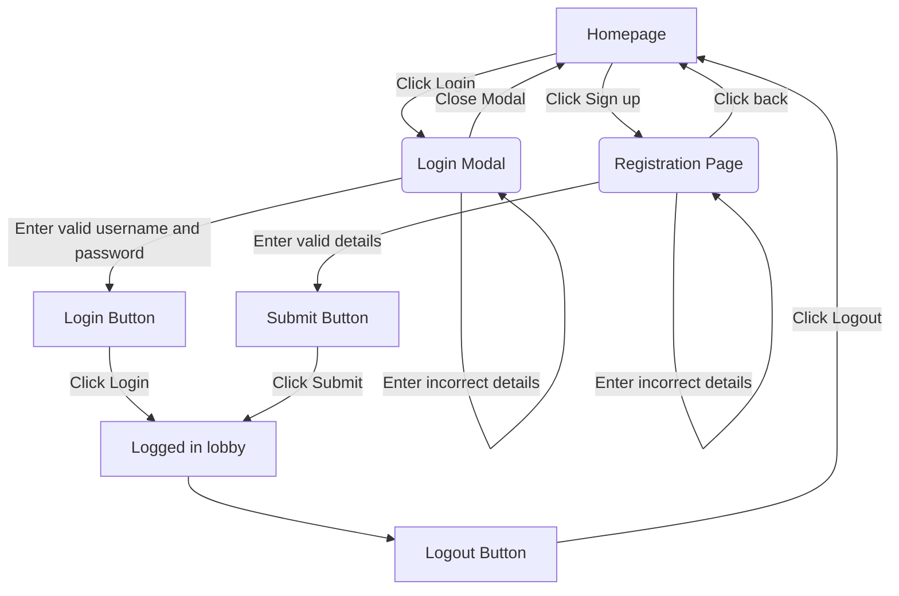

# IPM 2024/25. Práctica individual

El objetivo de esta práctica es el **diseño de una interface de
usuaria (IU)** para la aplicación que se describe más adelante.


> :warning: No conocer el contenido de este repositorio, README,
> enunciado, roles, ... conllevará una calificación de cero puntos.


> :warning: Los fechas para cada una de las fases representan límites
> duros e inamovibles. No existe ninguna posibilidad de realizar la
> práctica fuera de los períodos establecidos.


La práctica de realiza de manera individual y consta de dos fases:

  1. `16/09/2024T00:00` - `20/09/2024T23:59`: Esta fase abarca el
     diseño propiamente dicho.
	 
	 El resultado esperado es la documentación del diseño.
	 
  2. `23/09/2023T00:00` - `27/09/2023T23:59`: Durante esta fase se
     lleva a cabo una [revisión por
     pares](https://en.wikipedia.org/wiki/Peer_review) del trabajo
     realizado en la fase anterior.
	 
	 El resultado esperado son los informes de revisión.


Los resultados de ambas fases se subirán al espacio asignado a la
asignatura en el campus virtual de la universidad, usando la tarea
'Práctica individual'.


> :warning: No es posible realizar la segunda fase sin haber
> completado la primera dentro del período de tiempo establecido.


> :warning: Los resultados de esta práctica son el punto de partida
> para la primera práctica en grupo.


## La aplicación

La aplicación para la que estamos diseñando la interface es una
aplicación con una [interface gráfica de
escritorio](https://en.m.wikipedia.org/wiki/Graphical_user_interface).


El dominio de la aplicación se sitúa dentro del ámbito
sanitario. La/os usuaria/os son los facultativos que usaran la
aplicación para pautar los medicamentos y su posología de las personas
usuarias de los servicios sanitarios.
	
La aplicación se engloga dentro un sistema complejo, conformado por
distintas aplicaciones dirigidas a distintas tipologías de usuarias,
así como un servidor encargado de consolidar toda la información
disponible en el sistema y regular el acceso a la misma.

En los que respecta a la aplicación objeto de esta práctica, la/os
usuaria/os:

  - realizan las tareas clásicas de alta, baja y modificación de
    medicamentos asignados a un paciente.
	
  - realizan las taread clásicas de alta, baja y modificación de la
    posología de cada medicamento asignado a un paciente.


Para diseñar la inteface tienes que:

  1. Identificar qué tipos de usuaria pueden estar interesadas en usar
     la aplicación. En este caso, esta información ya nos viene dada
     por la propia naturaleza de la aplicación.
	 
  2. Comprender el dominio de la aplicación. Para esta aplicación,
     posiblemente el concepto menos conocido sea la _posología_.
	 
  3. Identificar los casos de uso de la aplicación.
	 
  4. Comprobar que dichos casos de uso son viables con el api que
     ofrece el [servidor](server.md).
	 
  5. Diseñar ua interface para cubrir dichos casos.
  
     Incluir en el diseño de la interface los elementos necesarios
     para gestionar los problemas de las comunicaciones en red:
     tiempos de respuesta largos, fallos del servidor, fallos de la
     red, ...

  6. Calcular la complejidad de la interface y generar los casos de
     prueba correspondientes.
	 

## Fase 1: Diseño

En esta fase tenemos que diseñar al interface de la aplicación y
obtener como resultado la documentación donde se describe dicho
diseño.

Por desgracia no existe un lenguaje estandarizado para especificar el
diseño de una interface de usuaria. Es decir, no disponemos de un
lenguaje análogo a los que usamos en diseño software como UML o C4.
Los lenguajes usados de basan en las convenciones y las normas
establecidas en cada organización.

El diseño de la interface tiene que cubrir dos aspectos principales:
_estático_ y _dinámico_ y ajustarse a las definiciones establecidas en
clase de teoría.


### La parte estática

La parte estática muestra la composición de la interface: los
elementos que la conforman y la disposición espacial de los mismos.

Al tratarse de interfaces gráficas, esta parte se expresa, como
cabría esperar, en su mayoría mediante un lenguaje gráfico. Ya
hemos dicho que no existe ningún estándar oficial o _de
facto_. Incluso la terminología puede variar de un autor a otro:
_wireframes_, mockups, low-medium-high fidelity, ...

Para esta práctica vamos a usar la siguiente definición:

> A wireframe is a static, low-fidelity representation of your
> product, a basic guideline of your website or app – the skeletal
> framework – for both designers and developers to follow.
>
> A low fidelity wireframe is the first visual representation of a
> designer’s idea.  It ensures that the developers and clients get
> a clear understanding of the functionalities and designs that
> the software needs to support.
>
> Wireframes are fast, cheap and easy to create. Consisting of
> boxes and lines, a wireframe can be as basic as a sketch on
> paper or a whiteboard.


> **Note** Como ya hemos comentado, para la definición que acabamos de
> ofrecer, algunos autores prefieren el término _wireframe_ a secas,
> mientras que otros prefieren el término _low fidelity wireframe_.

Para ilustrar esta definición la siguiente imagen muestra las
versiones low, medium y high fidelity de un mismo diseño:



Y a continuación varios ejemplos del tipo de wireframe que queremos
usar en esta fase del diseño. Como podemos observar, habitualmente
necesitaremos complementar la descripción gráfica con anotaciones que
faciliten su comprensión.





> :warning: La aplicación que estamos desarrollando realiza peticiones
> de red al servidor. No olvides que estas peticiones pueden
> fallar. El diseño de la inteface debe incluir estas situaciones


> **Note** Para distinguir entre wireframe y mid-fidelity emplearemos
> el siguiente criterio: si no se puede realizar a mano de forma
> razonable, es medium-fidelity.


### La parte dinámica

La parte dinámica muestra la manera en que la usuaria interactúa con
la interface. De nuevo, existen varios gráficos, diagramas, ... que
podemos usar: `user journey`, `user flow`, `task flow`, ... Y de nuevo
el uso de la terminología no es consistente por parte de los distintos
autores. Veamos a continuación un ejemplo (no software):



En esta parte del diseño tenemos que mostrar cómo transcurre la
interacción con la interface de usuaria en cada uno de los casos de
uso de la aplicación.

Dada la falta de estandarización y consenso, podemos usar el tipo de
diagramas y anotaciones que consideremos oportunos.

Independientemente de las opciones elegidas en este apartado, para
posibilitar el desarrollo del siguiente apartado, también debemos
crear un diagrama de flujo empleando el lenguaje
[_mermaid_](https://github.blog/2022-02-14-include-diagrams-markdown-files-mermaid/). A
continuación vemos un jemplo:


```
flowchart TD
    A[Homepage] -->|Click Login| B(Login Modal)
    A -->|Click Sign up| C(Registration Page)
    C -->|Click back| A
    B -->|Enter valid username and password| D[Login Button]
    B -->|Enter incorrect details| B
    B -->|Close Modal| A
    D -->|Click Login| E[Logged in lobby]
    C -->|Enter valid details| F[Submit Button]
    C -->|Enter incorrect details| C
    F -->|Click Submit| E
    E --> G[Logout Button] -->|Click Logout| A
```



### Información adicional sobre el diseño

Para complementar el diseño, debemos incluir los siguientes apartados:

  - Medida de la complejidad de la interface.

    Calcularemos la [_complejidad
    ciclomática_](https://en.wikipedia.org/wiki/Cyclomatic_complexity)
    del diagrama de flujo.

  - Generar los casos de prueba de la interface.
  
    No es necesario especificar los pasos que conforman cada caso de
    prueba. Para cada caso de prueba decidiremos si es relevante o no
	incluir los pasos de lo conforman.
	
  
Esta tarea es tediosa y repetitiva, pero por suerte la IA nos puede
echar una mano. Aquí encontramos un
[ejemplo](https://medium.com/@qa.gary.parker/using-mermaid-chatgpt-for-test-case-generation-and-management-18ed07e99a37).

En caso de usar una herramienta de IA para este apartado, tenemos que
especificar el generador y los prompts empleados para obtener los
resultados.
	
	

## Fase 2: Peer review

En esta fase debemos revisar los diseños realizados por algunos de los
compañeros. La plataforma del campus virtual nos asignara los trabajos a
revisar. Recuerda que no podrás acceder a esta fase si no completas la
anterior.

Para el buen funcionamiento de esta fase es imprescindible seguir esta
pauta sin excepciones:

  - Nuestras aportaciones tienen que ser exclusivamente __sugerencias
    para corregir y/o mejorar el diseño__. No se permite realizar
    críticas negativas al diseño que se está revisando.
